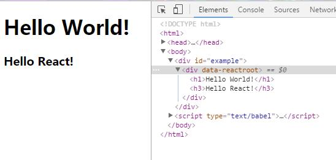
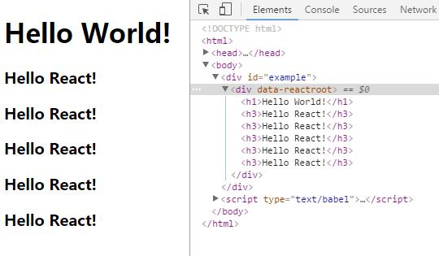
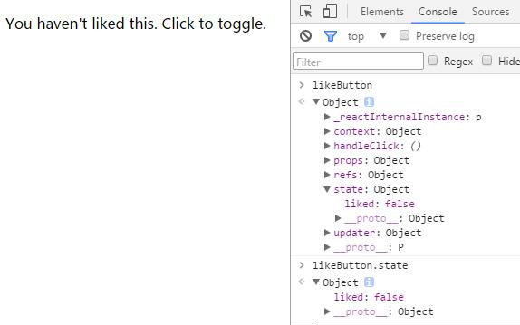
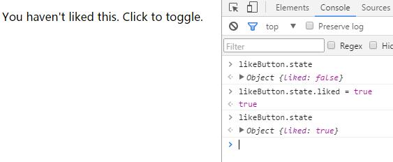

## react入门教程一

### react简介

React 起源于 Facebook 的内部项目，因为该公司对市场上所有 JavaScript MVC 框架，都不满意，就决定自己写一套，用来架设Instagram 的网站。做出来以后，发现这套东西很好用，就在2013年5月开源了。

由于 React的设计思想极其独特，属于革命性创新，性能出众，代码逻辑却非常简单。所以，越来越多的人开始关注和使用，认为它可能是将来 Web 开发的主流工具。

这个项目本身也越滚越大，从最早的UI引擎变成了一整套前后端通吃的 Web App 解决方案。衍生的 React Native 项目，目标更是宏伟，希望用写 Web App 的方式去写 Native App。如果能够实现，整个互联网行业都会被颠覆，因为同一组人只需要写一次 UI ，就能同时运行在服务器、浏览器和手机。

#### 特点：

1. 声明式设计：React采用声明范式，可以轻松描述应用。
2. 高效：React通过对DOM的模拟，最大限度地减少与DOM的交互。
3. 灵活：React可以与已知的库或框架很好地配合。

#### 一些好的学习途径：

> [阮一峰-React 技术栈系列教程](http://www.ruanyifeng.com/blog/2016/09/react-technology-stack.html)
>
> [react中文社区](http://react-china.org/)
>
> [官方文档](http://reactjs.cn/react/docs/getting-started-zh-CN.html)
>


### react入门知识储备

#### [ES6](http://es6.ruanyifeng.com/)

react推荐使用ES6语法，如果你已经熟悉ES6，那就最好去使用ES6。

但如果你并不很了解，使用之前的ES语法也是可以的，但在此之前，你一定要先了解ES6的 const，let 以及 箭头函数。

#### [Webpack](http://webpackdoc.com/) & [Babel](http://babeljs.cn/)

Babel用于将ES6及jsx语法翻译成浏览器可以识别渲染的语法，而Webpack则用于将这一过程自动化，从而提高开发效率。

前期学习过程中可以借助脚手架去配置Webpack和Babel，但是要试着去看懂理解他们的配置，逐渐去摆脱脚手架的束缚。


### react两种前端使用方法

#### 直接使用

通过script标签引入

```
<!DOCTYPE html>
<html>
  <head>
    <meta charset="UTF-8" />
    <title>Hello React!</title>
    <script src="https://cdn.bootcss.com/react/15.4.2/react.min.js"></script>
    <script src="https://cdn.bootcss.com/react/15.4.2/react-dom.min.js"></script>
    <script src="https://cdn.bootcss.com/babel-standalone/6.22.1/babel.min.js"></script>
  </head>
  <body>
    <div id="example"></div>
    <script type="text/babel">
      ReactDOM.render(
        <h1>Hello, world!</h1>,
        document.getElementById('example')
      );
    </script>
  </body>
</html>
```

注意：

1. 最后一个 `<script>`标签的 type 属性为 `text/babel` 。这是因为 React 独有的 JSX 语法，跟 JavaScript 不兼容。凡是使用 JSX 的地方，都要加上 `type="text/babel"` 。
2. 上面代码一共用了三个库： react.js 、react-dom.js 和 Browser.js ，它们必须首先加载。

#### webpack打包编译

安装node环境，使用npm安装依赖，创建项目，配置webpack，babel。。。

这里不再赘述，不会的可以参考这篇博文[webpack入门+react环境配置](http://www.cnblogs.com/zhengjialux/p/6376501.html)

每次开发都要去配置太麻烦了，熟悉webpack之后我们可以使用脚手架快速搭建开发环境

关于react脚手架的汇总和使用可以参考我的另一篇博文[快速构建React+Webpack+ES6项目](http://blog.chenshiwen.cn/React/%E8%84%9A%E6%89%8B%E6%9E%B6%E5%BF%AB%E9%80%9F%E6%9E%84%E5%BB%BAreact%E9%A1%B9%E7%9B%AE/)


### JSX语法及组件

#### JSX

React 使用 JSX 来替代常规的 JavaScript。

JSX 的基本语法规则：遇到 HTML 标签（以 `<` 开头），就用 HTML 规则解析；遇到代码块（以 `{` 开头），就用 JavaScript 规则解析。

```
ReactDOM.render(
  <h1>Hello, world!</h1>,
  document.getElementById('example'),
  function () {
    console.log('渲染结束回调函数在这里!')
  }
);
```

JSX语法具备以下特点：

1. 可以在 JSX 中使用 JavaScript 表达式。表达式写在花括号 **{}** 中。
2. 在 JSX 中不能使用 **if else** 语句，但可以使用 **conditional (三元运算)** 表达式来替代，这一点[官方文档](http://www.css88.com/react/tips/if-else-in-JSX.html)有详细说明。
3. React 推荐使用内联样式，但是这里内联样式作为对象的形势，使用{}包裹起来。
4. JSX 允许直接在模板插入 JavaScript 变量。如果这个变量是一个数组，则会展开这个数组的所有成员(数组中的每一项元素都需要添加一个[key](https://facebook.github.io/react/docs/lists-and-keys.html#keys)属性)。
5. JSX的注释使用`/* ... */`写在{}中。

tip：在jsx中给标签添加属性需要注意， `class` 属性需要写成 `className` ，`for` 属性需要写成 `htmlFor` ，这是因为 `class` 和 `for` 是 JavaScript 的保留字。

具体效果我们将在后面演示的代码中体现。

#### 组件

React 允许将代码封装成组件（component），然后像插入普通 HTML 标签一样，在网页中插入这个组件，官方是这么说的。但是实际上我们实际的业务代码基本都是一个又一个的组件堆砌而成，这样做有很多好处。首先得益于react的局部刷新，每次更新页面内容时我们只需操作和更新对应的组件即可，无需对整个页面进行重新渲染。组件使页面模块化，结构更加清晰。此外组件提高了代码的复用率，提高编码效率......

react使用React.createClass 方法生成一个组件类。

```
var HelloMessage = React.createClass({
  render: function() {
    return <h1>Hello World!</h1>
  }
});
 
ReactDOM.render(
  <HelloMessage />,
  document.getElementById('example')
);
```

上面就是一个简单的HelloMessage组件，这里需要注意：

1. 组件类的第一个字母**必须**大写，jsx使用标签首字母的大小写来区分原生标签和组件，上面代码中的HelloMessage组件如果命名为helloMessage，ReactDOM在渲染时会认为这是一个HTML原生标签，从而导致渲染失败。
2. 组件类只能包含**一个顶层标签** ，这个意思就是每一个组件必须要包裹在一个标签内，如果上面的代码写成`return (<h1>Hello World!</h1><h2>Hello React!</h2>)` ，即一个组件内存在两个顶层标签，这样是不被允许的。


**组件允许嵌套**，即一个组件内嵌套另一个组件：

```
var HelloMessage = React.createClass({
  render: function() {
    return (
      <div>
    	<h1>Hello World!</h1>
    	<MessageBox/>
      </div>
    )
  }
});

var MessageBox = React.createClass({
  render: function() {
    return <h3>Hello React!</h3>
  }
})
 
ReactDOM.render(
  <HelloMessage />,
  document.getElementById('example')
);
```

上面代码我们可以看到我们创建了一个新的组件MessageBox，并把它放在了HelloMeaasge组件中。同时大家也会注意到，我在HelloMessage的return中放了一个div包裹整个组件内容，这也是上面提到的组件只能有一个顶层标签的原因。另外标签一定注意闭合，包括组件标签，不然会报错不能正常渲染。浏览器中运行如下：



上面说到JSX的时候我提到了jsx可以自动展开数组，这里我们来试一下：

```
var HelloMessage = React.createClass({
  render: function() {
    var arr= [];
    for (var i = 0; i < 5; i++) {
      arr.push(<MessageBox key={i}/>)
    }
    
    return (
      <div>
    	<h1>Hello World!</h1>
    	{arr}
      </div>
    )
  }
});

var MessageBox = React.createClass({
  render: function() {
    return <h3>Hello React!</h3>
  }
})
 
ReactDOM.render(
  <HelloMessage />,
  document.getElementById('example')
);
```

这里我们创建一个数组，使用for循环把组件MessageBox循环五遍放进数组中，而在HelloMessage组件中我们仅仅使用花括号来包裹数组，react在解析时就会把这个arr作为js变量来解析，发现它是数组就直接展开数组内容。运行结果如下：



具体组件中的数据传递，我们将在下节中讲到。


### react数据载体

react中的数据载体有三个：state，props 和 context。他们在react起着重要的作用。

#### State

React 里主要使用state来定义组件内部状态。

在页面中我们只需更新组件的 state，然后用户界面就会根据我们的设定重新渲染。

来看下面的例子：

```
var LikeButton = React.createClass({
  getInitialState: function() {
    return {liked: false};
  },
  handleClick: function(event) {
    this.setState({liked: !this.state.liked});
  },
  render: function() {
    var text = this.state.liked ? 'like' : 'haven\'t liked';
    return (
      <p onClick={this.handleClick}>
        You {text} this. Click to toggle.
      </p>
    );
  }
});

ReactDOM.render(
  <LikeButton />,
  document.getElementById('example')
);
```

这段代码中我们首先定义了一个LikeButton组件，使用getInitialState方法定义初始状态，即一个对象，对象中的值可以通过this.state.liked获取。然后我们给p标签绑定一个点击事件handleClick，当用户点击时通过this.setState方法去改变liked的值。当react发现state的值发生改变，就会重新调用this.render方法重新渲染组件。细心的同学可能会注意到jsx中不能使用if，所以这里使用了三元运算符来改变text的值。

我们可以通过定义一个变量来获取render：

```
var likeButton= ReactDOM.render(
  <LikeButton />,
  document.getElementById('example')
);
```



在控制台中你会看到render返回的一个对象，里面包括了context，props，state这些值以及handleClick这样的事件等。这里可以看到state是一个对象，如果我们直接去改变这个state，虽然可以成功改变，但是你会发现页面没有任何变化：



在react中，state方法主要用于数据的调用，此时虽然数据更改了但是不会自动的使页面得到更新，而官方则给出了forceUpdate()方法去手动更新页面。所以在实际的项目中可以根据需求来决定使用setState来自动更新页面，还是使用state+forceUpdate。

#### Props & Context

props和context比较相似，是用于组件之间通信，不同的是props只能逐层传递，但是content可以跨组件传递。

虽然context很强大，但是[React官方文档](https://facebook.github.io/react/docs/context.html)却不推荐使用，首先props可以让你看到哪些数据在传递，可以使代码更易读，context则不然；其次context是react一个实验性API，有可能在未来的版本中移除。

在一般的项目中，简单的数据传递一般使用props，而复杂状态则使用Redux 或MobX状态管理库。

所以这里着重来说一下props，而对context感兴趣的童鞋可以去看这篇博客：[React 中 context 的使用](http://blog.chengjianhua.cn/2016/05/24/react-context/)

首先来写一个简单的demo：

```
var Button = React.createClass({
  render: function() {
    return (
      <button style={{background: this.props.color}}>删除</button>
    );
  }
});

var Message= React.createClass({
	render: function() {
		var test = [];
		var color = this.props.color;
		this.props.text.forEach(function(msg,index){
			test.push(<p key={index}>{msg}<Button color={color}/></p>)
		});
		
		return (
			<div>{test}</div>
		)
	}
})

var message = ReactDOM.render(
  <Message text={["这是一段文字","这是另一段文字"]} color={"red"}/>,
  document.getElementById('example')
);
```

这段代码首先创建一个Button组件，按钮的颜色定义为props。然后Button被嵌套进Message组件中。实际渲染时我们在 `<Mesaage/>` 中定义text和color的值，Message组件接收并将color传递给Button组件，同时使用forEach循环text数组。但是如果传来的text不是一个数组，那么forEach肯定会报错，这里就需要用到props的数据验证：

```
var Message= React.createClass({
	propTypes: {
		text: React.PropTypes.array,
	},
	getDefaultProps:function() {
		return {
			text: ["默认的消息"]
		}
	},
	render: function() {
		var test = [];
		var color = this.props.color;
		this.props.text.forEach(function(msg,index){
			test.push(<p key={index}>{msg}<Button color={color}/></p>)
		});
		
		return (
			<div>{test}</div>
		)
	}
})
```

这里给Message组件加了两个一个propTypes用于验证props的值类型，也可以在array后加`.isRequire`规定text值不能为空。以及getDefaultProps用于定义props的默认值。但是这里注意一点，出于性能原因，`propTypes`仅在开发模式下检查。更多propTypes的验证类型参考[官网文档](https://facebook.github.io/react/docs/typechecking-with-proptypes.html)。


——2017年3月20日


