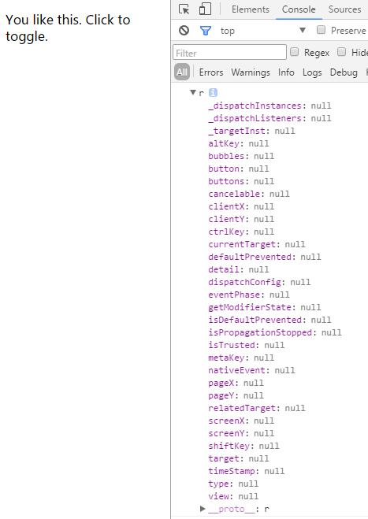
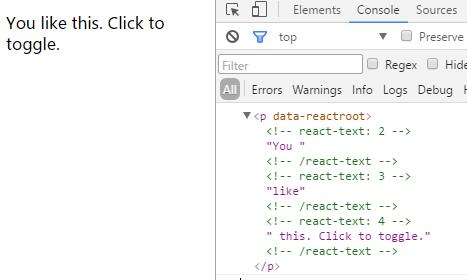
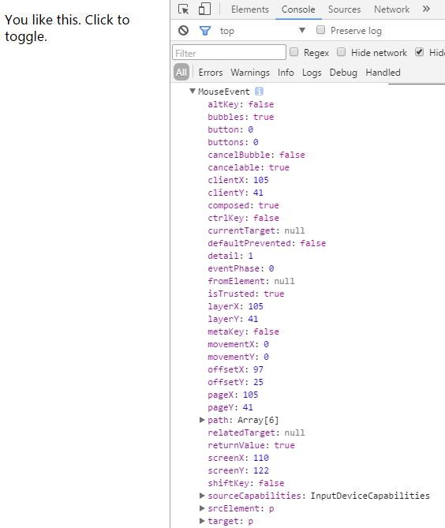
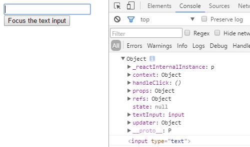

## react入门教程二

### react事件

由于react的虚拟DOM模式，react对所有的事件也都做了专门的处理和优化，官方的说法是引入了虚拟事件对象，将浏览器的事件进行了封装，有着浏览器本地事件西安通的属性和方法，但是没有兼容问题。听起来不错，回到我们之前state的demo，`handleClick(e){}`加一个`console.log(e)`来打印一下这个点击事件：



这里可以看到我们打印出来的全部是空，这是因为react给我们做了处理，把不需要的值全部隐藏了。现在我们来改一下`console.log(e.target)` :



可以看到target已经被打印出来了。如果你有时候需要的是本地的event的话可以使用e.nativeEvent来调用：



这里就是浏览器原生的event事件，但是需要注重浏览器兼容性。所以一般情况下最好使用react封装好的event事件，react支持的完整事件列表可以在[官方文档](http://www.css88.com/react/docs/events.html)查看，这里不再一一列举。

tip：如果需要阻止默认的事件，比如form表单的默认提交，a标签的href... 必须使用e.preventDefault() 。而需要阻止事件冒泡则需使用e.stopPropagation()。

> React事件机制不同于我们以往的js事件，为提高效率，它对事件做了二次处理，将所有项目中注册的事件全部代理（delegate）到顶层的document上，当你点击某个DOM的时候，它会找到这个DOM和其Component，并冒泡到找到对应的事件并触发。
>
> 比如我们经典的 ul li 结构，传统js使用事件委托将事件绑定在ul上，而现在使用react只需要在ul上绑一个click事件，每次点击ul里面的元素都会冒泡并触发到ul的事件上去。但是要注意如果你在ul里面再绑定一个事件，同时不使用stopPropagation去阻止这个冒泡事件，那他会一直执行到最顶层的事件上去。
>
> 想要深入了解React事件机制？相信这篇博客会对你有所帮助——[React源码解读系列 -- 事件机制](http://www.open-open.com/lib/view/open1488868982317.html)


### Refs  &  真实DOM 

由于react使用虚拟DOM的结构，所有的页面变动都先在虚拟DOM上处理，只有当他们真正插入到文档中才会转化成真实DOM，react正是通过这样的机制来减少DOM操作从而提高页面的性能。

但是有时候我们确实有获取DOM的需求，前面在学习事件的时候我们使用e.target可以获取到真实的DOM。

而同时react也给我们提供了refs 来处理类似的情况。ref在react中是一个特殊的属性，它可以是一个回调函数也可以是一个字符串。如果你查找国内的资料你会发现几乎所有人用的都是ref的字符串属性，但是在最新版（V15.4.2）的react文档中，ref的字符串属性被称为’Legacy API‘ ，官方强调字符串的ref存在一些问题，并且很可能在未来的版本中将其移除。 

我们先来看一下官方的demo：

```
var MyComponent = React.createClass({
  handleClick: function() {
    this.textInput.focus();
    console.log(this);
    console.log(this.textInput)
  },
  render: function() {
    return (
      <div>
        <input type="text" ref={(input) => { this.textInput = input; }} />
        <input type="button" value="Focus the text input" onClick={this.handleClick} />
      </div>
    );
  }
});

ReactDOM.render(
  <MyComponent />,
  document.getElementById('example')
);
```

ref的回调函数会在组件创建或者重新渲染时立即执行，回调函数的参数即为当前组件的真实DOM，我们可以立即使用这个DOM或者将其保存以备后用。

上面代码中输入框的ref使用es6语法直接在组件中创建了一个回调函数，这个函数将参数input保存到this.textInput中，我这里把  this  和  this.textInput  打印出来来帮助大家更好去理解：



这里this指向ReactElement，即当前的的react组件，通过回调函数往this里添加了textInput对象。通过下面的this.textInput就可以看到textInput为该组件的原生DOM，我们通过ref的回调函数将该DOM存在this中，方便后面随时调用。

简单的ref回调我们可以直接写在标签中，如果复杂的话我们可以将其抽出为一个函数，在标签中通过 `ref={this.funtionName}` 的形式调用。

同时我这里也有一个string refs的demo，虽然现在有很多人这样用，但是我们要尽量避免这样的写法：

```
var MyComponent = React.createClass({
  handleClick: function() {
    this.refs.myTextInput.focus();
  },
  render: function() {
    return (
      <div>
        <input type="text" ref="myTextInput" />
        <input type="button" value="Focus the text input" onClick={this.handleClick} />
      </div>
    );
  }
});

ReactDOM.render(
  <MyComponent />,
  document.getElementById('example')
);
```

这里给ref定义一个字符串，通过refs获取到页面所有的ref，再通过ref的字符串定位到该DOM，这样操作确实方便很多，所以这个方法被广为流传，但是建议有使用这样方法的童鞋最好慢慢抛弃这种写法。

tips：有些童鞋可能网上查找资料会看到getDOMNode()  or  findDOMNode() 方法，在早期react中确实存在这些方法结合ref来获取DOM，但是后来React拆分出ReactDOM后这些方法被归到ReactDOM 的方法中，直接在react中是不能使用的。


### react表单

在开始之前我们先看一个例子：

```
var Form = React.createClass({
  render: function() {
  	return (
  	  <input type='text' value='这是一个输入框'/>
  	)
  }
})
ReactDOM.render(
  <Form/>,
  document.getElementById('example')
);
```

乍一看是不是和我们平时HTML的写法基本一样，但是一运行你就会发现无论如何你改变不了input中的值，键盘的输入对它没有任何影响！

react官方将带有value的表单定义为**[受限组件](http://www.css88.com/react/docs/forms.html#)** ，即该组件受限制于value值，他将永远等于value的值。当然，不代表我们就不能定义表单的默认值了，官方给出了两种解决办法：

1，使用defaultValue。既然有受限组件，那就存在不受限组件。官方定义为不设置value的组件就是一个不受限组件，而不受限组件可以实时响应用户的输入将其反映到元素上。所以react就给组件定义了defaultValue来给组件设置一个非空的初始值，而对于radio，checkbox则有对应的defaultCheckd属性来代替checkd：

```
 <input type='text' defaultValue='这里是默认值，也可以使用state'/>
```

我们可以给input定义ref的回调来获取输入的值：

```
 <input type='text' ref={(input) => { this.textInput = input; }} defaultValue='这里是默认值，也可以使用state'/>
```

然后通过事件获取this.textInput.value。

比如我们一个页面有很多输入框，可以给他们分别定义ref，然后通过submit按钮的提交事件来一次性全部获取所有的输入值。

tip：如果我们需要阻止默认的表单提交事件，需要使用e.preventDefault()，这一点我们在之前的事件里提到过。 `( ) => { }` 为ES6语法，它表示为 `function( ) { }` 。

2，对于使用state来给组件设置初始值的，可以给组件绑定onChange事件，通过onChange来实时获取用户输入，动态的改变state的值。这样虽然组件受限于value，但是value的值发生了变化，那么组件的值也就跟着变化：

```
var Form = React.createClass({
  getInitialState:function(){
  	return {
  		inputValue: 'input',
  	}
  },
  handleInput:function(e) {
  	this.setState({inputValue: e.target.value});
  },
  render: function() {
  	return (
  	  <input type='text' value={this.state.inputValue} onChange={this.handleInput}/>
  	)
  }
})
ReactDOM.render(
  <Form/>,
  document.getElementById('example')
);
```

以上是使用e.target.value来获取输入值来刷新state，当然你也可以使用ref来获取。

如果页面中有很多表单，但是我们又不想使用上面的defaultValue+ref，或者我们需要在用户输入的时候就获取输入值来检查。岂不是每一个表单组件都要定义一个onChange事件？

官方也考虑到这种问题，所以给我们提供了一个更好的解决方案：

```
var MyComponent = React.createClass({
  getInitialState: function() {
    return {
      isGoing: true,
      numberOfGuests: 2
    };
    this.handleInputChange = this.handleInputChange.bind(this);
  },

  handleInputChange(event) {
    const target = event.target;
    const value = target.type === 'checkbox' ? target.checked : target.value;
    const name = target.name;
    this.setState({
      [name]: value
    });
  },
  
  render: function() {
    return (
      <form>
        <label>
          Is going:
          <input
            name="isGoing"
            type="checkbox"
            checked={this.state.isGoing}
            onChange={this.handleInputChange} />
        </label>
        <br />
        <label>
          Number of guests:
          <input
            name="numberOfGuests"
            type="number"
            value={this.state.numberOfGuests}
            onChange={this.handleInputChange} />
        </label>
      </form>
    );
  }
});

ReactDOM.render(
  <MyComponent />,
  document.getElementById('example')
);
```

通过一个onChange事件来解决所有的表单，是不是很酷！

tip: `[name]` 为ES6语法，它表示在对象中，name为一个变量。

tip：`<textarea>` 常规设置默认值采用 `<textarea>这里是默认值</textarea>` ，`<select>` 常规设置默认值是在 `<option>` 中添加selected，而这对于React来说会显得很奇怪，且不方便在后续的使用中来更新默认值。所以React中所有表单的默认值设置全部使用value（defaultValue）来定义，详细说明参见[官方文档](https://facebook.github.io/react/docs/forms.html#the-textarea-tag)。


### 生命周期

组件的生命周期分为三种：

- Mounting：已插入真实 DOM
- Updating：正在被重新渲染
- Unmounting：已移出真实 DOM

react为每个状态提供两种处理函数，will在函数状态之前调用，did则在函数状态之后调用：

- componentWillMount()
- componentDidMount()
- componentWillUpdate(object nextProps, object nextState)
- componentDidUpdate(object prevProps, object prevState)
- componentWillUnmount()

此外还有三种特殊状态的处理函数：

- constructor()：组件调用之前的构造函数，早于componentWillMount()，常用于声明props和state
- componentWillReceiveProps(object nextProps)：已加载组件收到新的参数时调用
- shouldComponentUpdate(object nextProps, object nextState)：组件判断是否重新渲染时调用


目前为止，我们所有的demo都是在单个页面通过外链react和babel的方式来演示。但是实际的开发过程中基本不会使用这种方式，接下来我们通过一个简单的练习学习在实际的开发环境中使用react，同时也对上面的内容做一个巩固。


—— 2017年3月22日


