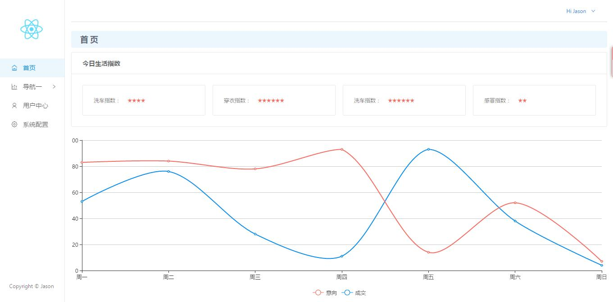

## react项目实战一

在前面的入门教程之后肯定很多人都会摩拳擦掌跃跃欲试。我这里就准备一个入门demo，帮助大家快速上手react。

之前在找react脚手架的时候找到了很多好东西，这里就是其中之一。有人把它归类为脚手架，其实他更像一个简单的demo。麻雀虽小五脏俱全，新手可以使用这个demo快速去熟悉react的项目结构。源demo Github：[React-seed](https://github.com/JasonBai007/react-seed)

### 准备工作

#### 克隆项目

这里给没有使用过Github的小白提供一个简单的方法，点击上面链接，再打开的页面中找到绿色的 **Clone or download** 按钮，点击后在弹窗中选择 Download ZIP  ，稍等片刻，浏览器就会把项目zip压缩包下载到本地。解压放到合适的路径即可。

使用过Github的同学就用你熟悉的方法克隆项目到本地。

#### 检查node环境

在这一步之前首选确保你电脑中安装有Node.JS，没有安装的同学可以去 [Node.JS官网](https://nodejs.org/en/download/) 下载最新版安装包安装。安装后打开控制台键入 `node -v`  ，控制台打印出版本号即视为安装成功。

#### 安装依赖

项目中用到了Yarn，yarn是facebook推出的开源JavaScript包管理器，速度优于npm。

使用控制台定位到项目目录，安装yarn和项目依赖，相关命令如下：

> 安装Yarn  : npm install -g yarn
>
> 安装依赖  : yarn

第一次使用yarn安装依赖会经常报错，而这多是网络问题（毕竟国外源），你可以多试几次，或者尝试这些解决办法：[「CYarn」使用 cnpm 源的 Yarn](https://cnodejs.org/topic/57ff0541487e1e4578afb48d) 。而在以后安装时由于yarn的离线性，速度会巨快 。当然用不惯yarn的也可以使用npm，命令差不多的。

### 熟悉结构

#### 项目目录

```
├── README.md                            // 项目说明文档
├── webpack.config.js                    // webpack开发配置
├── webpack.production.config.js         // webpack打包配置
├── .babelrc                             // babel配置文件
├── .gitignore         					 // github上传忽略文件配置
├── package.json       					 // 项目配置文件
├── yarn.lock          					 // 记录依赖包的具体版本号，保证每个开发的依赖都是一样的
├── node_modules          				 // 依赖包存放目录
├── docs          						 // 作者Github.io托管静态页面目录，可以删除
└── app                					 // 项目目录
    ├── dist           					 // 打包目录
    ├── src            					 // 开发目录
    │   ├── components 					 // 组件目录
    │   ├── data       					 // mock假数据存放目录
    │   ├── images     					 // 图片目录
    │   ├── less       					 // 样式文件目录
    │   ├── pages      					 // 页面级jsx目录
    │   ├── main.jsx   					 // 页面框架
    │   └── router.jsx 					 // 路由配置文件
    ├── favivon.icon   					 // 页面标题icon
    └── index.html     					 // 项目入口文件
```

项目目录十分清晰明了，我们首先查看package.json。这里可以看出项目中使用了   [animate.css](https://daneden.github.io/animate.css/)   [antd](https://ant.design/docs/react/introduce-cn)   [jquery](http://jquery.cuishifeng.cn/index.html)   [react,react-dom](https://tianxiangbing.github.io/react-cn/docs/getting-started.html)   [react-router](http://www.ruanyifeng.com/blog/2016/05/react_router.html?utm_source=tool.lu)  除此之外，项目还使用了 [less](http://lesscss.cn/)  和  [ES6](http://es6.ruanyifeng.com/) ，不会这些也没关系，CSS 和 ES5 一样可以。

其次熟悉一下Babel配置，打开.babelrc 。presets用于设定转码规则，es2015就是ES6，而stage代表es7的提案，后面的数字代表提案的四个阶段，分别是0-3，然后是react。

plugins则是插件的转码，这里作者也写了注释说明是为了做到antd插件的按需调用。

然后是Webpack的配置，这里作者使用了 webpack.config.js  和 webpack.production.config.js 分别定义了Webpack的开发配置和打包配置。对比两个配置可以看出，开发配置多了本地服务器的配置，但为了节省时间没有做压缩。而打包配置则专注于线上项目，加入了项目的压缩和控制台警告处理。

这个项目的webpack配置是一份十分标准的配置，初学者也可以不用费太大力气去读懂，而且配置比较完善。但在图片这里有个小坑，相信作者也清楚，在配置中写了注释标明publicPath会影响图片的打包路径。如果你也遇到了这样的问题，可以去文末寻找答案。

#### 项目结构

调出命令行，定位到当前目录键入 `yarn start`  项目即自动打包并调出浏览器打开 localhost:8080。如果你8080端口被占用，可以打开 webpack.config.js  手动修改端口号，不要忘记同时修改下方的 OpenBrowserPlugin 不然下次自动打开的依然是8080。

现在你可以看到demo的效果了：



该项目使用react-router做路由实现页面切换，通过router.jsx可以看到项目中的每个页面通过 `<Router/>` 实现按需加载，并最终通过ReactDOM.render渲染到index.html的 `#init` 中。

这里会用到一些React-Router的知识，如果你完全不会，不用担心，我会在后面单独讲这个。在这里你可以先不用管路由， 专心练习和巩固之前的入门知识。

### React实战一 -- 页面导航

打开 Sidebar.jsx 可以看出，该项目的侧栏导航栏使用 antd 制作，今天我们实战就是抛弃UI库，自己去写一个react的导航栏。在这个过程中深刻体会react的魅力所在。

首先删掉原有的Sidebar.jsx中的相关代码。一般我们做导航都是 ul li 结构，这里也采用这样的结构，废话不多说，直接上我写的代码：

```
import React from 'react';
import { browserHistory } from 'react-router';

export default class Sidebar extends React.Component {
    constructor(props) {
        super(props);
        this.state = {
            current: ''
        }
    }

    handleClick = (e) => {
        let id = e.target.id;
        this.setState({ current: id });
        if(id == "home"){
            browserHistory.push('/');
        }else{
            browserHistory.push(id);
        }
    }
    
    componentDidMount() {
        var now = window.location.pathname.substring(1);
        now = now === '' ? 'home' : now;
        this.setState({ current: now });
    }
    
    render() {
        return (
            <div id="leftMenu"> 
                
                <ul onClick={this.handleClick}>
                    <li id="home" className={this.state.current == 'home' ? 'choosed' : 'none'}>首页</li>
                    <li className={this.state.current == 'list' || this.state.current == 'report' ? 'choose' : 'none'}>导航一
                        <ul>
                            <li id="list" className={this.state.current == 'list' ? 'choosed' : 'none'}>子导航一</li>
                            <li id="report" className={this.state.current == 'report' ? 'choosed' : 'none'}>子导航二</li>
                        </ul>
                    </li>
                    <li id="user" className={this.state.current == 'user' ? 'choosed' : 'none'}>用户中心</li>
                    <li id="setting" className={this.state.current == 'setting' ? 'choosed' : 'none'}>系统配置</li>
                </ul>
            </div>                
        )
    }
}
```

样式除了排版之外使用伪类 `:hover` 给每个li添加了鼠标触发样式，这里不在列出，感兴趣的可以去我的Github下载查看。

从上往下看，首先import引入所有的依赖，这里用到了两个，react和react-router的 browserHistory 。这里先补充一个router的知识点：*browserHistory.push('/path')  //跳转到某个路径* ，后面会用到这个来做路由跳转。

继续往下看： `export default class Sidebar extends React.Component{}` 这句话意思是声明一个名为Sidebar的react组件并暴露来，这样在使用到这个组件的时候我们就可以通过import { 组件名 } from 路径，来将这个组件引入进来。

中间内容先跳过，我们直接来看下面的`render()`：这里结构很简单明了，一个div标签包裹ul li 结构，前面有讲到，render只能包含一个顶层标签，这里就是div。

这里几个小细节：首先本地图片使用 require() 引入，这么做是因为webpack打包会忽略掉js中的 url() 引入的图片（将其作为网络资源对待）。其次，这里给li添加样式的时候使用className而不是class，我在教程中有提到，class是JS的保留字。这里直接使用{}包裹的三元运算符来做样式的一个判断。

事件绑定这里只在最外层ul做了一次onClick的绑定，但是实际上你console.log(e.target)可以看到，react可以准确返回你点击的DOM。（前面入门教程二对react事件机制做了介绍）所以这里直接使用e.target.id就可以准确返回出你所点击的li标签的id，我们用这个值去刷新state，同时使用browserHistory.push() 去处理路由。

componentDidMount() 和 constructor() 我们在声明周期里提到了一下。前者是组件渲染后的回调函数，即组件在页面渲染完成后会立即执行componentDidMount()中的函数。而constructor()则是在组件渲染之前需要声明的一些元素，一般用来定义组件的props和state，props使用`constructor(props) { super(props); }`定义，state则是使用 `this.state = { }` 来定义。如果项目中需要全局变量，也可以在这里声明。

到这里，导航就完成了，别急，这只是开胃菜，接下来我们再来一个复杂的页面。


### React实战二 -- 表单综合练习

这里我们完成一个用户表单


### 踩坑

#### background图片路径问题

webpack中图片配置路径为dist/img/[name].[ext]，在实际打包中，因为react的虚拟Dom插入到index.html中，所以这样的路径相当于站在index的当前目录去寻找dist/img，当然能找到。但是css样式被打包成bundle.css放在dist/css目录下，而写在less中的background-image的实际寻找路径就变成了从当前目录出发的dist/css/dist/img...，所以会出现找到不图片的原因。

~~解决中尝试使用内联样式将backgroundImage放在jsx中，但是发现webpack打包时忽略了！即便尝试手动拷贝图片到dist/img，save一下热加载再次打包图片又没了！~~  后来发现这样其实是可以的，但是我这里引用图片使用的是url，html中的url在webpack中视为网络资源文件，在打包的时候会自动忽略掉，所以这里需要使用require引入图片。

后来尝试改变webpack开发配置，将publicPath路径修改为/，在loaders的图片配置将输出路径改为./dist/img/[name]的绝对路径，成功。同时为了保证其他打包资源的路径正确性，需要把其他所有的“js/”和“css/”前面都添加“dist/”。

然后修改打包配置，将path由/app/dist改为/app，publicPath由/dist改为/，loaders图片输出配置由/img/[name]改为./dist/img/[name]，其他所有的“js/”和“css/”前面都添加“dist/”。